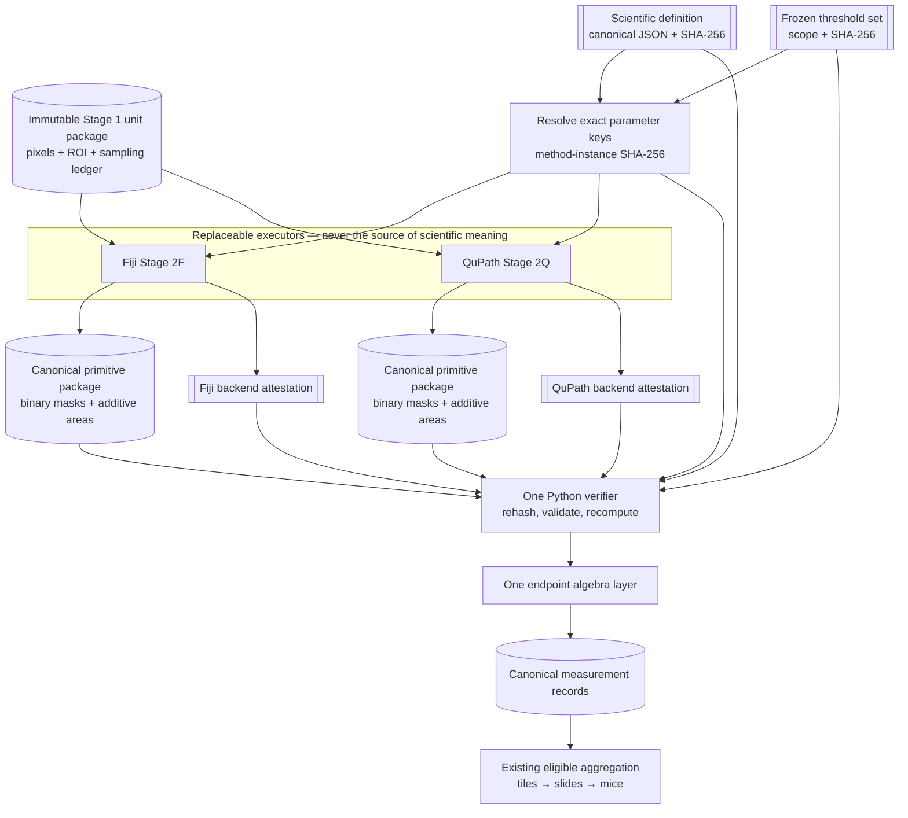

# IFQuant-Lung architecture vNext

> **Status: target architecture; Contract A foundation implemented.** The
> closed scientific-definition and frozen-threshold-set schemas, resolver, CLI,
> and tests now exist. Backend attestations, canonical primitive packages,
> numerical golden fixtures, and Stage 2Q do not. This work is prospective and
> non-retroactive: it does not alter, re-hash, reinterpret, or supplement the
> settled external confocal release. It does not approve QuPath, validate an
> endpoint, calibrate a threshold, establish ground truth, or promote an
> engineering comparison to a study result.

> **Successor decision (2026-08-29):** this document remains the tested
> migration reference for IFQuant-Lung. Further clean-slate cell/morphology and
> machine-learning work is assigned to the separate `IFQuant-Platform`
> repository described in
> [`IFQUANT_PLATFORM_HANDOFF.md`](IFQUANT_PLATFORM_HANDOFF.md), rather than a
> permanent development branch here.

Canonical current authority remains
[`authority/project_state.json`](../authority/project_state.json) and its
generated view, [`generated/AUTHORITY_STATUS.md`](generated/AUTHORITY_STATUS.md).

## 1. Decision in one sentence

Keep one immutable, backend-independent scientific definition; let Fiji and
QuPath produce separately attested primitive masks and additive measurements;
and let one Python verifier create canonical measurement records and all
derived ratios.

The first future QuPath implementation is a quarantined **Stage 2Q**
conformance route over existing Stage 1 tiles and ROIs. Fiji remains the
settled direct-confocal fluorescence engine. The WSI route remains an
engineering pilot and has no promoted production endpoint.

## 2. Current architecture

The current whole-slide route has a strong file boundary:

1. QuPath Stage 1 selects the VSI series, establishes the reference space, and
   exports calibrated OME-TIFF tiles, halo context, per-tile ROIs, candidate
   ledgers, manifests, and content hashes. It measures no fluorescence
   endpoint.
2. Fiji Stage 2 runs `IF_Quant_Pipeline.groovy` over those immutable units and
   emits masks and additive measurements.
3. Python Stage 3 validates the Stage 2 run index, reconciles exhaustive tile
   coverage and reference-space area, and sums tiles to slides.
4. Python Stage 4 validates eligible record batches and sums slides or fields to
   mice. Fractions are recomputed from pooled numerators and denominators.

```mermaid
flowchart LR
    VSI[(Olympus VSI/ETS package)]

    subgraph S1[Stage 1 — source and reference-space authority]
        Q1[QuPath reader/tiler]
        Units[OME-TIFF tiles + halo<br/>RoiSet + candidate ledger]
        M1[Stage 1 manifest<br/>source, pixel and ROI hashes]
        Q1 --> Units
        Q1 --> M1
    end

    subgraph S2[Stage 2 — current fluorescence measurement]
        F[Fiji<br/>IF_Quant_Pipeline.groovy]
        Native[marker masks + tile/region CSVs]
        I2[content-addressed Stage 2 index]
        F --> Native --> I2
    end

    subgraph S3[Stage 3 — reconciliation]
        P3[Python validation<br/>coverage + lineage + additive sums]
        Slide[slide-level additive summary]
        P3 --> Slide
    end

    subgraph S4[Stage 4 — record and mouse aggregation]
        R4[explicit route mapping]
        Records[schema-v2 measurement records]
        Mouse[mouse/group summaries]
        R4 --> Records
        R4 --> Mouse
    end

    VSI --> Q1
    Units --> F
    M1 --> I2
    I2 --> P3
    Slide --> R4
```

### 2.1 Contracts that are already route-neutral

- `schemas/measurement-record.schema.json` and `ifquant/contracts.py` define a
  common result record across `area_wsi`, `cell_confocal`, and `he_pathology`.
  They distinguish identity, endpoint and reference space, sampling,
  compartment, provenance, evaluability, QC, and review state.
- `ifquant/adapters.py` is the correct shared record-construction seam. It
  requires explicit mappings, preserves additive numerator and denominator
  values, and recomputes ratios rather than trusting a derived source column.
- `require_aggregation_batch_eligible()` rejects duplicate analytical
  identities and drift in profile, configuration, code, channel, model,
  endpoint, sampling, or compartment contracts.
- `provenance.inputs` already permits uniquely named, content-hashed artifacts.
  A scientific-definition hash can therefore be bound without weakening the
  existing record schema.

The `provenance.inputs` point is storage capacity, not an existing compatibility
gate.
`require_aggregation_batch_eligible()` intentionally does not compare generic
`provenance.inputs`; two records with different definition input hashes could
therefore pass its current checks. Stage 2Q records must remain outside current
aggregation until the new verifier explicitly requires one
`method_instance_sha256` across the batch.

### 2.2 Contracts that are intentionally route-specific

- `ifquant/route_records.py` is a Stage 4 bridge for current aggregation CSVs,
  not a general backend plug-in interface. Its WSI assertions require the
  current Stage 1/Stage 2 lineage, including Fiji Stage 2 script and run-index
  fields.
- Its production-gated `area_wsi` code path accepts slide records with exhaustive
  whole-section coverage. A selected engineering tile must not be disguised as
  such a record.
- The current Stage 2 `measurement_profile_sha256` includes implementation
  artifacts such as Stage 1 and Stage 2 scripts, resolved configuration,
  runtime and segmentation profiles, and channel/configuration bindings. It is
  an **execution-profile hash**, not a backend-independent scientific-definition
  hash.

These distinctions are safeguards. Stage 2Q must not populate Fiji-named
lineage fields with approximate QuPath equivalents or redefine an existing hash
in place.

### 2.3 The scientific definition is currently distributed

Marker interpretation is partly declarative in
`config/lung_marker_registry.json`, relational endpoint logic is partly
declarative under `config/endpoints/`, and implementation parameters and
operation order remain in `IF_Quant_Pipeline.groovy`. Therefore, merely giving a
QuPath script the same threshold number would not establish the same method.

For the initial KRT5 area primitive, the current Fiji order is materially
important:

1. operate on the complete exported tile, including halo context;
2. blur the raw marker channel;
3. threshold and convert it to a binary foreground mask;
4. connected-component filter that complete mask by calibrated area; and
5. only then intersect it with the named measurement ROI when counting positive
   pixels.

Clipping to an annotation before component filtering is a different
measurement, even when every numeric parameter is identical.

## 3. Target architecture: three contracts

### 3.1 Contract A — scientific measurement definition

The scientific definition is a closed, versioned, canonical JSON artifact. It
contains only choices that can change the meaning or numerical result of a
measurement. The implemented v1 is deliberately narrow and declares:

- stable definition ID and version;
- endpoint primitive and reference-space IDs;
- semantic marker inputs and the required intensity coordinate,
  representation, transform, and calibration contract, but no acquisition
  channel index or label;
- plane or Z policy and pixel-calibration requirements;
- blur kernel, sigma units, truncation, numerical precision and border policy;
- fixed-threshold policy, comparator semantics and foreground polarity;
- connected-component connectivity;
- minimum/maximum calibrated area, inclusivity at each boundary, and edge
  handling;
- the processing frame and order, including halo use and filter-before-clip
  behavior;
- numerator and denominator definitions and units;
- observed-zero, invalid-denominator and not-evaluable behavior; and
- ratio-of-sums aggregation semantics.

The artifact must exclude backend name, application version, script path,
runtime, thread count and output location. Canonical serialization produces a
`scientific_definition_sha256` that is identical for conforming Fiji and QuPath
executions.

The implemented v1 is a numerical mask kernel over a supplied canonical 0/255
reference mask. It does not define how a tissue or anatomy mask is constructed
or reviewed, nor the field/slide sampling design or biological estimand.
Confocal automatic-DAPI tissue, its whole-field exception, WSI tissue, and WSI
tissue-minus-airway are therefore distinct upstream contracts. The generic
`measurement_roi_v1` primitive must not be used to imply that those reference
spaces are interchangeable or analytically comparable.

Scanner- or batch-specific fixed thresholds are a separate immutable
threshold-set artifact. It binds an exact definition ID, version, and canonical
hash; a declared applicability scope, representation, bit depth, and transform;
an explicit scope-binding state; and the complete set of parameter IDs and
values. A content-addressed scope requires a profile hash, while
`identifier_only_unattested` explicitly carries none. A resolver rejects
missing, unused, misnamed, out-of-range, wrong-marker, or wrong-definition
bindings. It then hashes a domain-separated descriptor containing both canonical
hashes as `method_instance_sha256`. Adaptive thresholds are not substitutable
for that instance.

The implemented artifacts are:

- [`schemas/scientific-measurement-definition.schema.json`](../schemas/scientific-measurement-definition.schema.json)
  and [`ifquant/measurement_definition.py`](../ifquant/measurement_definition.py);
- [`krt5_positive_area_kernel_v1.json`](../config/measurement_definitions/krt5_positive_area_kernel_v1.json),
  whose endpoint ID matches canonical project authority rather than the legacy
  CSV column name;
- [`schemas/frozen-threshold-set.schema.json`](../schemas/frozen-threshold-set.schema.json)
  and the explicitly limited
  [`g_surf_confocal_260808_krt5_threshold_candidate_v1.json`](../config/measurement_definitions/g_surf_confocal_260808_krt5_threshold_candidate_v1.json);
  and
- [`scripts/validate_measurement_definition.py`](../scripts/validate_measurement_definition.py),
  which can enforce expected definition, threshold-set, and method-instance
  hashes.

The checked-in threshold set only **names the intended confocal reconstruction
scope**. It binds no acquisition bytes or scope profile, and its binding state is
`identifier_only_unattested`. It carries no authorization and cannot be
transferred to WSI, another scanner, staining batch, or cohort. The CLI prints
`authorization: none`. A future governance/release manifest must bind reviewed
authority separately; governance prose and status must never perturb the pure
scientific hash.

Canonical identity uses repository-owned canonical UTF-8 JSON: duplicate keys,
non-finite numbers, negative zero, unsafe integers, unknown fields, and
unsupported types are rejected; object keys are sorted; integral numeric forms
are normalized; and pipeline array order is preserved. Raw-file SHA-256 remains
separate for byte provenance.

Both future executors must read and validate these artifacts. Constants
duplicated in two scripts are not a shared contract. No executor consumes them
yet.

### 3.2 Contract B — backend execution attestation

Each execution publishes a backend-specific, content-addressed attestation that
answers what actually ran. It includes:

- backend and application version;
- executed script or package hash;
- runtime, extension and model identities when applicable;
- exact scientific-definition and threshold-set hashes consumed;
- source unit, Stage 1 manifest, pixel and ROI hashes;
- effective execution configuration;
- output mask, primitive table and log hashes;
- assigned, succeeded and failed unit identities;
- capped/dry-run/completeness state; and
- run ID and portable relative artifact roles.

Attestations may differ between Fiji and QuPath. Their difference is expected
and must remain visible. A shared definition permits a conformance claim; it
does not erase implementation provenance.

For future schema-v2 engineering records, preserve the current meaning of
`measurement_profile_sha256` as the execution-profile hash and add the shared
definition, threshold set, and resolved method instance through fixed
`provenance.inputs` roles. The standalone verifier must compare those roles;
the current generic aggregation gate does not. A future record schema may make
scientific and implementation identities first-class, but migration must be
explicit and versioned.

### 3.3 Contract C — canonical primitive package and one verifier

Executors emit evidence and additive primitives, not authoritative fractions.
For each observation, the package contains:

- complete observation identifiers;
- endpoint primitive and reference-space IDs;
- source-pixel and ROI-mask hashes;
- canonical binary positive mask and its hash;
- pixel dimensions and calibration;
- reported positive and reference areas;
- scientific-definition and threshold-set hashes; and
- backend-attestation hash.

The canonical mask format must define byte order, dimensions, foreground values
and pixel ordering so masks can be rehashed and compared independently of an
application's display conventions.

One repository-owned Python verifier then:

1. validates all schemas and re-hashes every bound artifact;
2. confirms source, ROI, calibration, channel and observation identity;
3. verifies canonical mask values and dimensions;
4. recomputes positive and reference areas from pixels and calibration;
5. recomputes ratios from additive values;
6. applies shared relational mask algebra where required;
7. emits records through `ifquant/adapters.py`; and
8. invokes aggregation eligibility only when the declared sampling frame,
   coverage, QC and review state permit it.

Neither backend-native CSV fractions nor backend-specific endpoint algebra enter
analytical aggregation directly.

## 4. Immutable boundaries

| Boundary | Frozen before | Invariant |
|---|---|---|
| Raw source package and selected series | Stage 1 | Exact VSI/ETS membership, series identity and source hashes cannot change. |
| Sampling/reference space | Any measurement | Candidate ledger, export windows, halo, core/region ROI masks and calibration are content-bound. |
| Scientific definition | Fiji/QuPath comparison | One reviewed artifact is supplied to both executors; neither executor may override semantic fields. |
| Threshold set | Any scoped comparison | Applicability declaration, binding state, and artifact bytes are frozen before comparison data are processed; governance authorization is separate. |
| Backend implementation | Each run | Script/runtime/config hashes are captured before and after execution. |
| Primitive output | Verification | Fresh output location, atomic publication, no existence-only resume, complete identity ledger. |
| Verified records | Aggregation | Python-derived additive values, QC/review state and provenance are immutable inputs. |
| Analytical pool | Statistical analysis | One implementation contract per endpoint scope unless a separately approved statistical design explicitly models method effects. |

No downstream stage may repair a missing identity, infer a blank as zero, invent
whole-section coverage, or replace a failed hash with a filename match.

## 5. Staged Stage 2Q plan

### Stage 2Q-0 — definition and fixtures

- [x] Add the closed scientific-definition contract and a single KRT5
  positive-area kernel.
- [x] Add a separate scope-bound threshold-set contract and deterministic
  method-instance resolver. The checked-in confocal candidate is not a WSI
  threshold and carries no authority.
- [x] Encode complete-plane/halo processing and filter-before-ROI order
  explicitly.
- [ ] Create deterministic synthetic OME-TIFF, ROI and expected-mask fixtures.
- [ ] Declare and review a WSI-specific engineering applicability and threshold
  set. Never reuse confocal threshold 300 for WSI.

### Stage 2Q-1 — quarantined tile conformance

- Run a separate QuPath script over the existing Stage 1 OME-TIFF tile and
  `_RoiSet.zip` interface. Do not measure directly from VSI in this phase.
- Implement only the fixed-threshold KRT5 area primitive.
- Do not add cell detection, pixel-classifier training, StarDist, InstanSeg,
  membrane ownership, morphology-state calls, or relational endpoints.
- Emit canonical binary masks, additive areas and a QuPath attestation.
- Use the shared Python verifier and `build_ratio_measurement_record()` to emit
  `area_wsi`, `record_level: tile` engineering records.
- Keep Fiji and QuPath record sets separate. Do not pass these records through
  the current WSI `route_records.py` slide gate and do not pool them to mice.

This seam holds source pixels, halo and reference space constant, so the first
comparison isolates one numerical measurement kernel.

### Stage 2Q-2 — paired real-tile engineering validation

- Execute both backends on the exact same immutable unit packages.
- Stratify fixtures across empty, weak, bright, crowded, seam-adjacent,
  airway-containing and alveolar regions.
- Investigate every systematic mask difference; do not tune on the intended
  confirmatory cohort.
- Preserve paired artifacts and signed differences, not only summary metrics.

### Stage 2Q-3 — exhaustive engineering slide

- Define and validate a QuPath run-index/attestation schema.
- Require an exact one-to-one match with the Stage 1 candidate ledger, no
  missing or duplicate unit identities, no cap, no failures and no stale output.
- Reconcile the sum of reference areas against Stage 1 before permitting a
  slide-level engineering record.
- Continue to exclude Stage 2Q results from production mouse aggregation.

### Stage 2Q-4 — scientific validation and possible promotion

Only a prospective, reviewed validation can promote Stage 2Q. It must address
threshold calibration, biological reference annotations, scanner/batch scope,
reproducibility, representative sampling and the declared endpoint estimand.
Passing software conformance alone is insufficient.

If promoted, backend selection must be explicit and cohort-wide. Fiji remains
available as the rollback implementation, and historical Fiji and new QuPath
measurements are not silently combined as one homogeneous batch.

## 6. Validation and promotion gates

| Gate | Required evidence | Failure consequence |
|---|---|---|
| E0 — definition contract | Closed schema, separate threshold set, method-instance hash, no backend/governance/acquisition fields, every semantic operation explicit | No executor comparison |
| E1 — synthetic numerical conformance | Threshold-boundary, blur-edge, connectivity, area-boundary, ROI-order, halo, empty-mask and anisotropic-calibration fixtures | Stage 2Q remains experimental |
| E2 — provenance integrity | Source/ROI/profile/script/output rehashing, fresh output, complete identity ledger, tamper rejection | No result record |
| E3 — paired real-tile agreement | Predeclared mask/area acceptance criteria, signed error analysis and morphology-stratified review | No exhaustive slide run |
| E4 — exhaustive slide integrity | Complete candidate coverage, no duplicates/failures/cap, exact lineage, reference-area reconciliation | No slide record |
| S0 — biological endpoint validity | Independent reviewed reference, frozen thresholds, scanner/batch scope and representative validation set | Engineering-only status |
| S1 — replacement agreement | Predeclared equivalence limits for the intended endpoint and scale; no reliance on correlation alone | QuPath is not promoted; Fiji remains the incumbent comparison implementation |
| P0 — governance promotion | Versioned approval, documentation update, release artifact, rollback plan and explicit effective date | No production aggregation |

Exact canonical mask equality is the strongest evidence that Stage 2Q is a
second implementation of the same numerical method. If library differences
prevent exact equality and only tolerance-based agreement is achieved, QuPath
must be described as an **alternative measurement method** until a predeclared
method-comparison study establishes acceptable interchangeability. High
correlation alone cannot establish this because it can coexist with systematic
bias.

## 7. Required test families

### Definition and hashing

- Reject missing and unknown fields.
- Prove canonical hash stability across whitespace and object key order.
- Prove representative semantic mutations alter the definition hash.
- Prove a threshold change alters only threshold-set and method-instance hashes,
  not the scientific-definition hash.
- Reject runtime, backend, acquisition-channel, governance and path fields from
  the scientific definition.
- Reject duplicate keys, negative zero, non-finite and unsafe numeric forms.
- Cross-check exact threshold parameter, marker, definition, applicability and
  bit-depth bindings.

Initial tests cover these contract families in
[`tests/test_measurement_definition.py`](../tests/test_measurement_definition.py).
They do not replace the numerical golden fixtures below.

### Numerical golden fixtures

- Pixels immediately below, equal to and above the threshold.
- Gaussian border and precision behavior.
- Diagonally touching foreground for connectivity.
- Components immediately below, equal to and above the calibrated area cutoff.
- Components crossing a non-rectangular ROI and the tile/core boundary.
- A discriminator for filter-before-clip versus clip-before-filter.
- Empty foreground as an observed zero and zero/invalid reference area as
  not-evaluable or failure, never a fabricated fraction.
- Non-square pixel calibration.

### Producer and attestation integrity

- Reject absent, duplicate or reordered channels and inconsistent acquisition
  labels.
- Reject dimension, calibration, source, ROI, definition, threshold, script,
  mask and table hash drift.
- Reject stale/nonempty publication roots, missing units, duplicate IDs,
  failures, caps and partial runs.
- Recompute areas from canonical masks rather than trusting producer tables.

### Differential and aggregation behavior

- Run Fiji and QuPath on identical bytes and compare masks before comparing
  derived areas.
- Report signed pixel and area differences alongside overlap metrics.
- Confirm additive tile numerators and denominators reconstruct the slide and
  fractions are recomputed after pooling.
- Reject mixed implementation profiles within one endpoint aggregation scope.
- Reject a shared scientific-definition mismatch even when endpoint names are
  the same.
- Confirm incomplete tile coverage cannot claim a whole-section estimand.
- Confirm shared relational endpoint algebra produces the same result from
  conforming primitive masks.

## 8. Record compatibility during migration

Schema-v2 can support the engineering phase without semantic overloading:

- use `measurement_profile_id` and `measurement_profile_sha256` for the actual
  execution profile as they are used today;
- bind `scientific_measurement_definition`, `frozen_threshold_set`,
  `method_instance`, `source_pixels`, `reference_space_mask`, `positive_mask`,
  `primitive_table` and `backend_attestation` as explicit
  `provenance.inputs` roles;
- emit tile-level records directly through `ifquant/adapters.py`;
- leave review pending or QC non-passing until the appropriate gate is complete;
  and
- store paired Fiji and QuPath records in separate sets because the current
  analytical identity has no implementation dimension.

Merely storing those roles is insufficient. The new verifier must re-hash them
and require one method-instance hash before calling the existing aggregation
eligibility code.

A future schema should separate scientific-profile identity from implementation
identity and include an explicit backend/method-instance field. That schema
change should be made only when paired-method records need to coexist as
first-class data, not merely to make Stage 2Q easier to wire into Stage 4.

## 9. Non-goals

This architecture does not:

- declare QuPath superior to Fiji;
- make a QuPath pixel classifier equivalent to the existing threshold/component
  algorithm;
- make QuPath Cell Detection or InstanSeg equivalent to the current Fiji
  nucleus, ownership and morphology rules;
- validate StarDist or any other segmentation model;
- transfer a threshold across scanner, bit-depth, staining batch or acquisition
  regime without validation;
- establish biological ground truth from Fiji/QuPath agreement;
- authorize mixed-backend pooling; or
- change the mouse, rather than tile or cell, as the statistical unit.

## 10. Promotion statement

Stage 2Q is an engineering reform: it separates scientific meaning from
execution provenance and makes alternative implementations testable against
the same inputs. It is **not scientific promotion**. Until independent endpoint
validation and the explicit promotion gates pass, QuPath outputs are comparison
artifacts only; the direct-confocal settled release and its Fiji engine remain
unchanged; the WSI route remains engineering-only; and no biological conclusion
may rely on Stage 2Q results.
